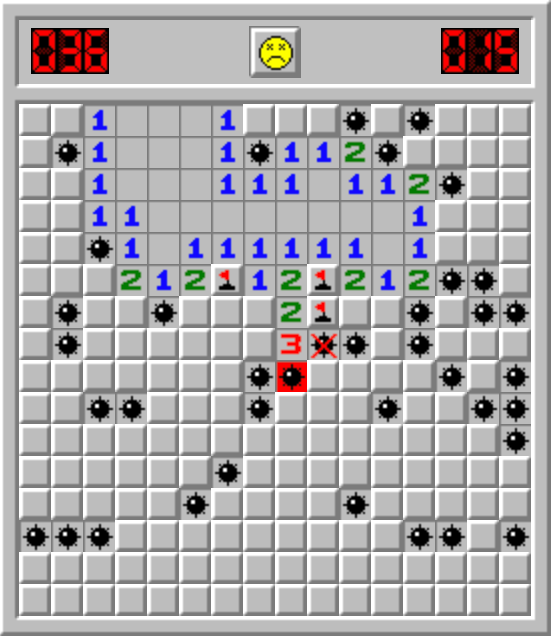

# Minesweeper

## Цель проекта:
Создать всем известную игру сапер, используя HTML, CSS, JavaScript и приложенный спрайт.
Правила:
- поле 16×16 клеток, 40 мин;
- слева счетчик мин от 40 до нуля, справа секундомер
- мины расставляются случайно;
- первый клик никогда не должен быть по мине;
- если рядом с открытым полем есть другие поля без мин поблизости, они открываются автоматически;
- правая клавиша ставит флажок - так отмечается место, где предполагается мина;
- если кликнуть правой кнопкой по флажку, ставится вопрос, еще раз - выделение снимается;
- клик по смайлику перезапускает игру;
- испуганный смайлик - пользователь нажал на поле, но еще не отпустил кнопку мышки;
- после проигрыша смайлик заменяется на грустный, пользователю раскрывается карта мин;
- после того, как пользователь открыл все поля кроме мин, смайлик надевает солнечные очки, секундомер останавливается.

## Как запустить:

- Склонировать репозиторий c помощью команды git clone или же скачать zip архив и распаковать его
- Находясь в корне проекта, через консоль выполнить команду npm i
- Выполнить команду npm run build:dev и следом команду npm run start
- ввести в браузере адресс который будет находится в консоле при выполнение команды npm run start (http://localhost:????/
  )